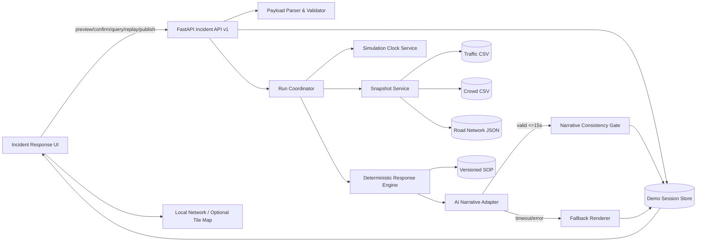
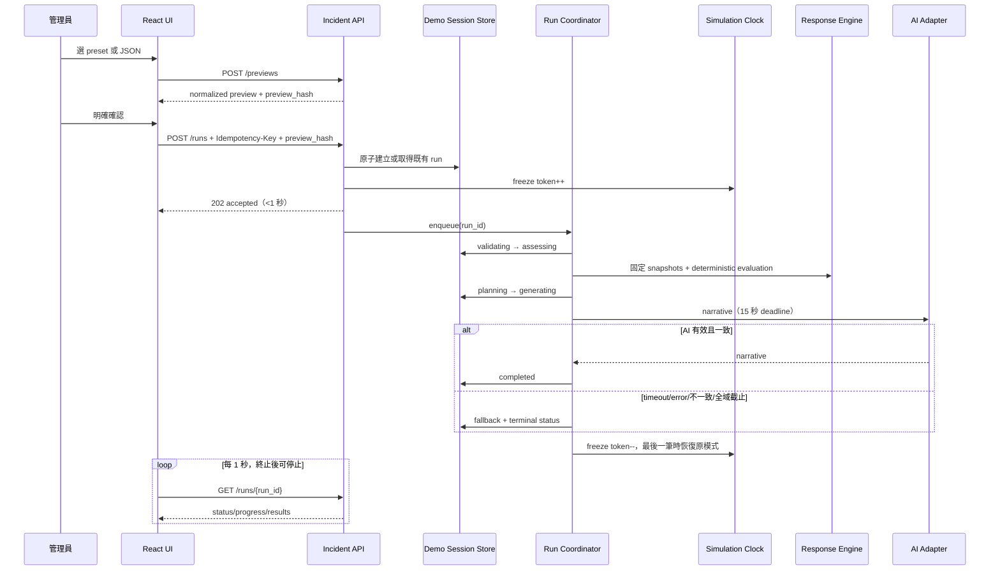
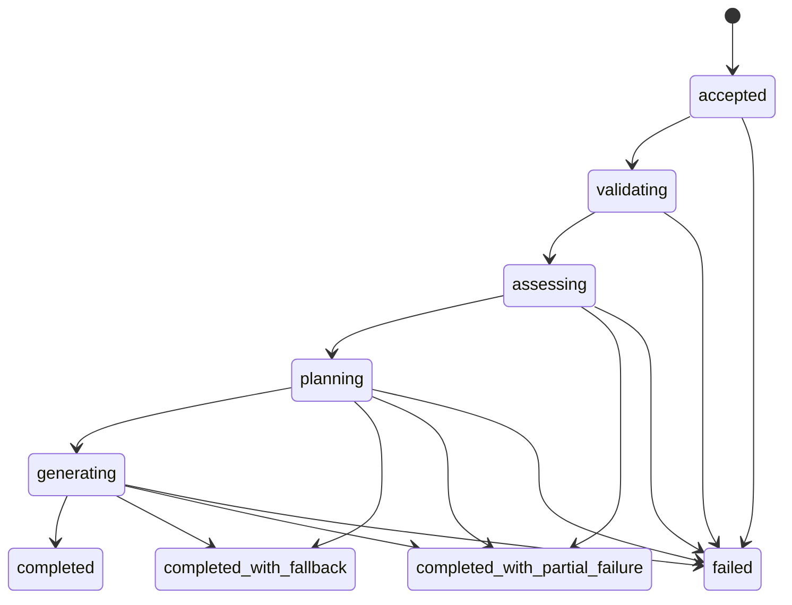

# Design Document：incident-injection-response

## 文件狀態與範圍

- 規格：`incident-injection-response`
- 工作流程：Requirements-First
- 階段：Design
- 契約版本：`1.0`
- 目標：在現有 React 19／FastAPI／單一 ECS Fargate task 架構內，建立可於競賽現場穩定重播、60 秒內完成、可追溯且可離線降級的事件注入與處置流程。
- 本文件只定義設計，不修改產品程式碼。

### MVP 必做與延伸邊界

| 層級 | 內容 |
|---|---|
| **MVP 必做** | 三種版本化 preset、JSON 預覽與嚴格驗證、非同步 Incident_Run、Demo Session 內冪等與最近 100 筆歷程、Simulation Clock 凍結／恢復、strict as-of snapshot、SOP 2／3／5／6／7 程式判定、路徑與 ETE、Decision Trace、15 秒 AI timeout 與 55／58 秒全域截止、fallback、進度／地圖／歷程／重播／模擬發布、無 Bedrock 與無公網降級、Monitoring Alert 明確升級。MVP 涵蓋 requirements.md 的全部驗收條件。 |
| **延伸項目** | DynamoDB／SQS 或其他耐久佇列、多 task 水平擴充、跨 Demo Session 稽核、真實 CMS／簡訊／交通控制整合、正式 RBAC、GIS 路網引擎、WebSocket／SSE 進度推播、多租戶、長期資料治理。這些不是本競賽 POC 驗收前置條件。 |

## Overview

目前實作已具備 FastAPI、React、模擬時鐘、交通數學函式、Bedrock 呼叫與事件畫面，但事件 API 仍同步等待完整處理，JSON 上傳與直接注入驗證不一致；`traffic_math` 的預設插值會讀取下一筆資料，路徑函式在無合格方案時仍強制回傳路線，AI 供應商錯誤也可能被呈現成建議。新設計在既有單體內增加清楚的應用服務邊界，不重寫部署形態：

1. **契約先行**：所有 preset、直接 JSON 與檔案上傳都進入同一個 parser／validator；先預覽、再以預覽雜湊確認。
2. **快速受理、背景處理**：API 在建立 Incident_Run 後立即回 `202 accepted`；lifespan 管理的工作協調器執行後續階段。
3. **先決定、後敘事**：Response Engine 只做可重現的分類、SOP、路徑、ETE、跨系統建議與 CMS；AI 僅將固定結果轉為繁體中文敘事。
4. **時間一致**：每筆事件以 Effective Event Time 建立不可變的 strict as-of snapshot，不插值、不讀未來、不隨全域時鐘後續推進而改變。
5. **Demo 優先的可靠性**：AI 15 秒逾時即 fallback；55 秒強制 fallback、58 秒封箱、60 秒前端完成刷新。公網或 Bedrock 不可用時仍有完整規則結果。
6. **可稽核但不暴露思考鏈**：Decision Trace 保存結構化輸入、規則比較、候選與排除理由；不保存或展示模型私有推理。

### 研究與現況結論

設計研究以 repository 實作、資料檔、SOP 及官方框架文件為依據：

- `backend/main.py` 現有 `/api/incidents` 與 `/api/incidents/upload` 都同步呼叫 `run_commander`；需改為共同受理服務與查詢式生命週期。
- `backend/sim_clock.py` 的時間軸目前是兩來源時間的**聯集**，且支援連續模式；Requirement 13 需要另建立只含兩來源 Complete Time Slice 的**交集播放軸**。
- `backend/agents/traffic_math.py` 的 `interpolate` 會使用未來量測，且早於資料起點時退回最早資料；Incident Snapshot 必須使用獨立 strict-as-of 實作，禁止這兩種行為。
- `calculate_optimal_route` 現況宣告「絕不回傳 null」，與無合格主路徑時必須回報不可規劃不相容；新 Response Engine 不沿用該 fallback 語意。
- `architect.py` 目前讓 AI 產生特殊處置，且錯誤字串可能成為 narrative；新設計把 SOP 3／5 動作改為 deterministic templates，AI 只負責敘事。
- 現有部署腳本固定 ECS `desired-count 1`，所以競賽 MVP 可採單程序 Demo Session Store；程序重啟即開始新 Demo Session，符合「不要求跨 Demo Session 永久保存」。
- Python 3.13 的 [`asyncio` timeout／task API](https://docs.python.org/3.13/library/asyncio-task.html) 可用單調時鐘實作 15、55、58 秒 deadline；FastAPI 的 [Background Tasks 文件](https://fastapi.tiangolo.com/reference/background/)顯示工作會在回應後執行，但本設計改用 lifespan 擁有的明確 coordinator，才能追蹤、取消與關機收斂。
- Pydantic 的 [strict mode](https://docs.pydantic.dev/latest/concepts/strict_mode/) 避免把錯誤型別悄悄轉換；跨欄位分類與關聯完整性則由 model validator 與 domain validator 負責。

上述外部文件內容均以改寫方式整理，以符合授權限制。

## Architecture

### 邏輯架構



### 執行序列



### 部署與一致性選擇

MVP 不新增 broker 或資料庫。FastAPI lifespan 建立 `RunCoordinator`、bounded task set 與 `DemoSessionStore`；所有狀態突變經單一 `asyncio.Lock`／thread-safe lock。ECS 維持一個 task、一個 Uvicorn process。這能在競賽 POC 中保證：

- idempotency、history cap、publish atomicity 與 clock freeze counter 都在同一一致性邊界；
- 不依賴公網；
- 沒有外部基礎設施導致的展示風險。

限制是程序重啟會遺失執行中與歷史資料；啟動後建立新 `demo_session_id` 並回到起始時鐘。若未來擴至多 task，Store、idempotency index、queue 及 freeze lease 必須一起移至共享耐久服務，不可只把 ECS desired count 調高。

### 狀態機與截止時間



- `accepted_at_monotonic` 是 deadline 依據；`accepted_at` 是 UTC+8 顯示／稽核時間。
- 事件受理後立即取得 clock freeze lease；freeze 使用 reference count，第一筆保存原播放／暫停狀態，最後一筆 terminal 才恢復。
- 55 秒：取消尚未完成的 AI 等待，全部改用 fallback。
- 58 秒：以已固定的逐事件結果封箱；至少一筆 Required Result 完整則依成功／失敗與 fallback 決定 terminal status，否則 `failed`。
- terminal commit 以 compare-and-set 執行一次；任何晚到 AI、重複 worker 或非法狀態轉移只能記錄 sanitized operational event，不得改寫結果。
- UI 每 1 秒輪詢；查得狀態後最多 2 秒反映。可延伸 SSE，但非 MVP 必需。

## Components and Interfaces

### 1. Incident Payload Parser／Validator

責任：

- 檔案層先驗證 `.json`、UTF-8、1–1,048,576 bytes；直接 JSON 與上傳後都交給相同 `parse_payload(raw_json)`。
- 僅接受非空頂層陣列，或**只有** `incidents` 欄位且值為非空陣列的物件；最多 100 筆，保留陣列順序。
- Pydantic strict model 驗證型別、trim 後長度、severity、UTC+8 真實曆法時間；domain validator 驗證 category、status、路段／站點存在性、重複 event_id。
- Signal Failure 條件與 BS 前綴同時成立時是多分類衝突；零個或多個分類都整批拒絕。
- 回傳所有可收集錯誤，路徑格式如 `incidents[2].severity`；不回傳 stack、檔案絕對路徑或供應商資訊。
- normalized payload 會 trim 字串、保留事件順序，以 canonical JSON（object key 排序、UTF-8、固定 separators）計算 SHA-256；陣列絕不排序。

預覽只是 server-side、短生命週期（Demo Session 內）的 `Preview`。UI 新選擇無效內容時不覆蓋目前有效 Preview；preset 版本或內容雜湊改變會使 confirmation token 失效。

### 2. Preset Registry

MVP 內建三份唯讀 fixture，preset ID 與版本是 API 契約的一部分。每份只有一筆事件，且指向現有資料可形成穩定黃金結果的時間：

| preset_id / version | Payload 摘要 | 固定有效時間 | 黃金結果重點 |
|---|---|---|---|
| `road-disruption/v1` | `RD_TPE_002`、`Blocked`、`High`，位置為忠孝東路四段交會處 | `2026-05-20 22:15` | SOP 2；`RD_TPE_004` 為上游主候選且飽和度 0.85，標記壅塞例外；`RD_TPE_005` 為下游次要；事故路段 ETE 70 分鐘；列出其餘候選排除理由。 |
| `crowd-surge/v1` | `BS_MRT_BL17`、`High` | `2026-05-20 22:15` | User Count 31,000 觸發 SOP 3；建議北捷過站不停、公車接駁、步行至 `BS_MRT_BL18`；因未提供道路影響範圍，road ETE 不可計算。 |
| `signal-failure/v1` | `RD_TPE_013`、`Power_Failure`、`Medium` | `2026-05-20 22:15` | SOP 5；三個不重複路口、建議 6 名警力；飽和度 0.78，ETE 36.8 分鐘；附近 `BS_TPE_101` roaming 45%，觸發 SOP 6 四語 CMS。 |

Fixture 同時保存 `expected_schema_version`、SOP/data version 與 golden deterministic JSON；若基礎資料更新造成 golden diff，CI 必須明確審核並提升 preset 或 data version，不能靜默接受。

### 3. Simulation Clock Service

在既有 `SimulationClock` 外建立事件處置所需介面：

```text
now() -> ClockState
common_timeline() -> [timestamp]
acquire_freeze(run_id) -> FreezeLease
release_freeze(lease) -> ClockState
play() / pause() / reset()
```

- `common_timeline` 僅取 Traffic 與 Crowd 各自通過 Complete Time Slice 驗證的 timestamp 交集，升冪且不插值。
- freeze lease 是冪等的；同 run 重複 acquire／release 不改變 counter。
- 第一個 lease 保存 `pre_freeze_mode` 與精確 simulation time，切至 fixed；最後一個 lease 釋放時，原為播放則由凍結點續播，原為暫停則維持暫停。
- 未來情境只改變事件的 Effective Event Time，不呼叫 clock configure；UI 必須先取得 future-simulation confirmation。
- Demo reset 只允許 active run count = 0；原子清除 session、threshold rearm state、previews／publish records，並將時鐘回到 common timeline 起點。

### 4. Snapshot Service

介面：

```text
build_snapshot(effective_event_time, required_sources) -> SnapshotBundle
```

每個來源分開找 `<= Effective Event Time` 的最近 Complete Time Slice。**不得**呼叫插值模式，也不得在無過去資料時退回未來最早資料。首次建立後把以下內容深拷貝至 Incident Run：

- source name、actual data time、availability、unavailable reason；
- 通過驗證的原始紀錄（只存本次判定需要的完整 source slice；MVP 資料量可接受）；
- source version（檔案 SHA-256 + schema version）；
- static Road Network 與 SOP 的 version／hash。

Complete Time Slice 驗證：該 timestamp 至少一列，所有列必要欄位與型別有效，該 slice 內 ID 唯一。Road Network 另檢查 segment ID 唯一、alternatives／nearby stations 參照存在於已知全集、容量與 ordered intersections 合法。來源不可用不一定使整批 run 失敗；Response Engine 將受影響判定標 `indeterminate` 或結果標不可計算，最後依 Required Result 決定逐事件成功。

### 5. Deterministic Response Engine

純函式介面：

```text
evaluate(incident_record, snapshot_bundle, versions) -> DeterministicResult
```

禁止讀檔、讀全域時鐘、呼叫 AI 或修改輸入。相同 normalized incident、snapshot bytes、road/SOP/version 必須逐欄位相同；`generated_at`、duration 等非決策欄位不放進 Deterministic Result。

處理 pipeline：

1. 依已驗證 category 建立適用 SOP 列表。
2. 對 SOP 2／3／5／6 寫出 `triggered | not_triggered | indeterminate` 與 typed comparisons。
3. Road Disruption 依路網 `alternatives` 原始順序建立候選，不得加入其他路段；事故路段永遠排除。
4. 直接相交採雙向名稱關聯判斷；上／下游必須能把 `location` 對應到事故路段 ordered intersections，並依標準化 `flow_direction` 決定順序。無法可靠映射時是 `direction_indeterminate`，不得沿用目前「陣列前半部」猜測。
5. 主候選條件為容量 ≥1000、直接相交、上游且有 saturation；穩定排序鍵 `(saturation, segment_id)`。下游合格者以同鍵列次要。沒有主候選時回 `unplannable`，不建立假路徑。
6. 主候選全都 saturation ≥0.85 時仍選第一名，但標 `congestion_exception`，加入固定的長綠燈與大眾運輸建議。
7. ETE 僅在有效 affected road saturations 與 severity 都存在時計算：`base + max(0, (arithmetic_mean - 0.5) * 60)`；不提前整數化，輸出至多 2 位小數。
8. Crowd Surge 觸發 SOP 3 時產生固定三項模擬建議；未觸發時同三項明確為 `not_recommended`。
9. Signal Failure 以受影響道路集合的 intersections 去重後乘 2 計算警力；道路 snapshot 不可用時 ETE 不可計算。
10. CMS 使用 deterministic localized templates，不交給 AI 自由生成；根據 nearby station roaming 結果決定繁中或四語，逐語限制 160 Unicode 字元並做 facts allow-list validation。

### 6. AI Narrative Adapter 與 Consistency Gate

AI input 只包含一筆事件的 Deterministic Result、引用 SOP 片段與格式 schema，不提供原始未清理檔案或其他 session 資料。要求回傳：

```json
{
  "narrative": "500 字元內繁體中文",
  "claims": {
    "sop_numbers": [2],
    "identifiers": ["RD_TPE_004"],
    "numbers": [0.85, 70],
    "times": ["2026-05-20 22:15"],
    "actions": ["long_green"]
  }
}
```

Consistency Gate 先 strict parse，再從 narrative 抽取 SOP 編號、系統識別碼、時間與數字 token；兩者都必須是 Deterministic Result facts allow-list 的子集合，主要處置與 ETE／不可計算語意也須吻合。任何未知事實、超過 500 字元、非繁中主要內容或 schema 錯誤都捨棄全文。呼叫自開始最多等待 15 秒；同步 Strands 呼叫放入 thread，外層 async task timeout 後不再接納結果。fallback reason 僅可為 `timeout | service_error | consistency_failure | global_deadline`，UI 不顯示原始供應商錯誤。

Fallback Renderer 直接從 Deterministic Result 套用繁中模板，因此不需要 Bedrock、公網或模型重試。terminal commit 後的 AI 回傳由 run version／terminal guard 忽略。

### 7. Run Coordinator 與 Demo Session Store

`DemoSessionStore` 保存：

- ordered runs（新到舊查詢、內部按 accepted sequence）；
- `run_id -> IncidentRun`；
- `(contract_version, idempotency_key) -> payload_hash, run_id`；
- `monitoring_alert_id -> promoted_run_id`；
- previews、publish records、threshold rearm state、freeze leases。

受理交易在同一 lock 內完成：檢查 idempotency、建立 immutable normalized input、寫 accepted run、加入 history、取得 freeze lease、enqueue。第 101 筆只移除最舊且 terminal 的歷史；由於 reset 在 active run 期間禁用，若理論上最舊仍 active，延後 eviction 至 terminal，避免執行中資料消失。

Coordinator 對 deterministic event evaluation 可 bounded parallel；AI task 也 bounded，接近全域 deadline 時未開始或未完成者直接 fallback。逐事件錯誤隔離，因此一批可形成 partial failure。所有 transition 經 `transition(expected, target)` 驗證表；stage duration 使用 monotonic clock，展示 duration 使用數值毫秒／秒而非牆鐘相減。

### 8. Monitoring Alert Bridge

Monitoring Dashboard 每次 common timeline 前進時比較同一 segment 的前後 snapshot。對 0.85 與 0.95 各維護 armed bit：只在 `< threshold` 到 `>= threshold` 時建立一次 alert；降回 threshold 以下才 rearm。Alert 固定保存 previous/current value、threshold、level、data time 與 `time_series_alert` Source Label。

升級端點先建立預填 Preview，Source Label 為 `monitoring_promotion`；明確確認後以 alert ID 作天然冪等鍵。Incident Run 保存 `origin_monitoring_alert`，注入本身不改 alert 數量、值或 rearm state。Scenario／upload 分別使用 `scenario_preset`／`json_upload`。

### 9. API 契約

所有成功與錯誤 body 含 `contract_version: "1.0"`；所有無 offset 時間字串為 UTC+8 `YYYY-MM-DD HH:MM`，並在 envelope 帶 `timezone: "UTC+08:00"`。

| Method | Path | 用途／主要回應 |
|---|---|---|
| `GET` | `/api/v1/incident-presets` | 三個 preset ID、version、摘要。 |
| `POST` | `/api/v1/incident-previews` | JSON body 預覽；回 preview ID/hash、normalized events、categories、future flags、possible SOP。 |
| `POST` | `/api/v1/incident-previews/upload` | multipart `.json`；與上列共用 parser。 |
| `POST` | `/api/v1/incident-runs` | Header `Idempotency-Key`；body 含 preview ID/hash、source、future confirmation；回 `202`、run ID、accepted、count、Location。 |
| `GET` | `/api/v1/incident-runs/{run_id}` | status、progress、durations、fixed snapshots、逐事件結果；terminal 後內容不可變。 |
| `GET` | `/api/v1/incident-runs?limit=100` | Demo Session 歷程，新至舊。 |
| `POST` | `/api/v1/incident-runs/{run_id}/replays` | 以歷史固定 input/version/effective time 建新 run，保存 `replay_of_run_id`。 |
| `POST` | `/api/v1/monitoring-alerts/{id}/preview` | 產生升級預覽，不直接執行。 |
| `POST` | `/api/v1/incident-runs/{run_id}/simulated-publications` | 原子記錄選定語言；body 帶 message version 防止 stale publish。 |
| `POST` | `/api/v1/demo-session/reset` | 無 active run 且明確確認時重設。 |
| `GET/POST` | `/api/v1/simulation-clock...` | 查詢、播放、暫停、重設；active run 時由 freeze policy 拒絕會推進時間的操作。 |

受理回應範例：

```json
{
  "contract_version": "1.0",
  "timezone": "UTC+08:00",
  "run_id": "ir_01...",
  "status": "accepted",
  "source_label": "scenario_preset",
  "accepted_at": "2026-05-20 22:15",
  "event_count": 1,
  "status_url": "/api/v1/incident-runs/ir_01..."
}
```

錯誤 envelope：

```json
{
  "contract_version": "1.0",
  "error": {
    "code": "INCIDENT_FIELD_INVALID",
    "message": "事件欄位驗證失敗",
    "trace_id": "tr_01...",
    "details": [{"path": "incidents[0].severity", "code": "enum", "message": "僅接受 Critical、High、Medium"}]
  }
}
```

狀態碼：malformed JSON／欄位錯誤 `400` 或 `422`、找不到 `404`、idempotency payload conflict／active reset／stale preview `409`、檔案過大 `413`、不支援副檔名／媒體型別 `415`、內部建立或查詢失敗 `500/503`。5xx 只帶 trace ID；server log 也不得記錄完整上傳內容、憑證、Bedrock 原錯誤 body。

### 10. Frontend Incident Response UI

以 reducer／finite-state view model 管理 `empty → preview_valid → confirmed/accepted → running → terminal/history`，避免目前單一 `report` state 混合預覽與結果：

- **預覽**：三個 preset 快捷卡與 JSON drop zone；顯示數量、原順序、category、位置、severity、事件時間、可能 SOP、future simulation 警示。無效新檔只在旁顯示錯誤，不清掉有效預覽。
- **確認**：內容或 preset version 改變即清確認；future event 額外勾選「以事件時間預演」。取消不呼叫 run API。
- **進度**：顯示 Source Label、run ID、stage、完成／總數、elapsed、60 秒 budget；每秒 poll，網路短暫失敗採 1/2 秒 capped retry，但保持上次狀態並標資料可能過期。
- **事件切換**：多事件依原始 index tabs 切換，不依成功或 category 重排。
- **結果分區**：Deterministic Result、Decision Trace、`AI 生成說明` 或 `SOP 備援說明` 三區不可混排；category-specific heading 與完成訊息。
- **地圖**：事故紅實線、主路徑綠粗線、次要藍虛線、壅塞例外橘色、站點紫色、不可用資料灰色；無座標時顯示 reason，不影響文字結果。
- **離線地圖**：路段 geometry／站點與 marker SVG 隨前端 bundle 提供；外部 tile 僅 progressive enhancement，載入錯誤即切至本地 SVG／canvas network view，不使用目前時間資料補歷史缺口。
- **歷程／重播**：右側最近 100 筆，新至舊；歷史只讀，固定顯示當時 snapshot／trace／publish；Replay 一定建立新 run ID。
- **Simulated Publish**：確認與完成對話框固定顯示「Simulated_Publish－未連接真實通路」；只允許 CMS facts validation 通過的語言。
- **Demo Reset**：active run 時 disabled；成功後清除前端 preview／confirm／history cache 並重抓 clock。

### 11. 可觀測性與安全

每次 request／run／event 使用 `trace_id/run_id/event_id` 結構化 log；記錄 transition、stage duration、fallback reason、snapshot versions、result counts，不記完整 narrative prompt、憑證、私有路徑或 stack 至 API。監控指標至少包含 accepted latency、run terminal latency、各 terminal status、AI timeout/error、fallback rate、validation reject、idempotent hit/conflict。上傳只讀一次且受 byte limit；檔名不參與 server path；所有 UI 文字依 React escaping 顯示，JSON 不以 `dangerouslySetInnerHTML` render。

## Data Models

以下為邏輯模型；實作可用 Pydantic v2 models／dataclasses，API 欄位使用 snake_case。

### IncidentPayload 與 IncidentRecord

```text
IncidentPayloadV1
- contract_version: Literal["1.0"] (API envelope；上傳文件可省略)
- incidents: tuple[IncidentRecordV1, ...]  # 1..100，順序有意義
- normalized_hash: sha256

IncidentRecordV1
- event_id: str[1..64], trim
- type: str[1..64], trim
- location: str[1..120], trim
- affected_segment: str[1..64], trim
- severity: Critical | High | Medium
- description: str[1..500], trim
- timestamp: UTC+8 local datetime string YYYY-MM-DD HH:MM
- status: optional str[1..64]
- category: Road_Disruption | Crowd_Surge | Signal_Failure  # server derived
- original_index: int
```

Category 規則先各自計算 predicate，再要求恰有一個為真。`timestamp` parse 後仍以無 offset 的 UTC+8 contract string 序列化；內部使用 aware datetime `+08:00`。

### Preview

```text
IncidentPreview
- preview_id, preview_hash
- source_label
- preset_id?, preset_version?
- normalized_payload
- event_summaries[]
- created_at, expires_at
- simulation_clock_time
- contains_future_event
- required_confirmations: [payload, future_simulation?]
```

Preview 不是 Run；確認前不凍結 clock、不增加 history。確認時 server 重算 hash 並比對，防止 stale UI 注入。

### IncidentRun

```text
IncidentRun
- run_id, demo_session_id, contract_version
- source_label: time_series_alert | scenario_preset | json_upload | monitoring_promotion
- status: accepted | validating | assessing | planning | generating |
          completed | completed_with_fallback |
          completed_with_partial_failure | failed
- accepted_at, terminal_at?, accepted_monotonic
- payload_hash, normalized_payload (immutable)
- idempotency_key_hash  # 不保存原 key
- preset_ref?, origin_monitoring_alert?, replay_of_run_id?
- simulation_clock_at_accept
- snapshot_bundle? (immutable after first set)
- stage_timestamps, stage_durations_ms
- progress: completed_count, total_count
- fallback_used, fallback_reasons[]
- success_count, failure_count
- event_results: tuple[IncidentEventResult, ...]  # original order
- missing_required_results[]
- version: int  # CAS/late result guard
```

Terminal 後，除獨立的 `PublicationRecord` 外 Run 不可變；發布狀態由查詢時以 run ID join，避免修改 terminal result。

### SnapshotBundle

```text
SnapshotBundle
- effective_event_time
- simulation_clock_time
- traffic: SourceSnapshot[TrafficRecord]
- crowd: SourceSnapshot[CrowdRecord]
- road_network: StaticSourceSnapshot[RoadSegment]
- sop: StaticSourceSnapshot[SopRule]

SourceSnapshot
- source, schema_version, content_hash
- requested_as_of
- actual_data_time?
- availability: available | unavailable
- unavailable_reason?
- records: tuple[...]  # immutable
- validation_summary
```

Traffic／Crowd 的 actual data time 可彼此不同，但都不得晚於 event time；Decision Trace 必須逐來源顯示。

### DeterministicResult 與 DecisionTrace

```text
DeterministicResult
- result_schema_version
- event_id, category, effective_event_time
- input_versions
- sop_decisions: tuple[SopDecision]
- route_plan?: RoutePlan
- ete: EteResult
- signal_actions[]
- cross_system_actions[]
- cms_message_set: CmsMessageSet
- required_result_check

SopDecision
- sop_version, article
- status: triggered | not_triggered | indeterminate
- comparisons: [{field, observed, operator, threshold, outcome}]
- missing_inputs[]

DecisionTrace
- trace_schema_version
- event_id
- times: {effective_event_time, simulation_clock_time, source_actual_times}
- normalized_input_subset
- source_availability[]
- rules[]
- route_candidates[]
- ete_calculation?
- selected_actions[]
- excluded_options[]
```

`DecisionTrace` 不含 prompt、token log、模型 scratchpad 或 chain-of-thought。

### RoutePlan 與 ETE

```text
RouteCandidate
- source_order, segment_id, name
- capacity_vph?
- directly_intersects: true | false | indeterminate
- direction: upstream | downstream | indeterminate
- saturation?
- stable_sort_key?
- eligibility: primary | secondary | excluded
- selected: bool
- exclusion_reasons[]

RoutePlan
- status: planned | unplannable | not_applicable
- incident_segment
- primary_route?
- secondary_routes[]
- congestion_exception
- candidates[]

EteResult
- status: calculated | unavailable | not_applicable
- affected_segments[]
- saturation_values[]
- arithmetic_mean?
- severity?, base_clearance_minutes?
- congestion_penalty_minutes?
- total_minutes?
- missing_inputs[]
```

### AI、CMS、發布與錯誤

```text
NarrativeResult
- mode: ai | fallback
- label: AI 生成說明 | SOP 備援說明
- text
- validated_claims
- fallback_reason?

CmsMessageSet
- status: publishable | not_publishable
- multilingual_triggered
- sop6_status
- messages: {language, text, char_count, facts_valid}[]
- failed_languages[]

PublicationRecord
- publication_id, run_id
- message_set_hash
- languages[]
- messages[]
- published_at (UTC+8)
- mode: simulated
- channel_notice: Simulated_Publish－未連接真實通路

ApiError
- code, message, trace_id
- details: [{path?, code, message}]
```

Publication 的全部語言在 store lock 下以一筆 record 寫入；驗證任一語言失敗就不寫任何 record。


## Correctness Properties

*屬性（property）是系統在所有有效執行中都應成立的特徵或行為，也就是對系統應做之事的形式化陳述。屬性是人類可讀規格與機器可驗證正確性保證之間的橋梁。*

### Property Reflection

逐條 prework 後依下列原則去重：

- 將所有字串長度、severity、時間格式合併成一個「嚴格事件契約」property，避免每欄一個重複測試。
- 將合法狀態轉移、非法轉移拒絕合併成 model-based state-machine property；terminal mapping 與 terminal immutability 保持獨立，因兩者會找到不同錯誤。
- 將 exact/as-of/no-future 合併成單一 snapshot selection property；來源 schema 完整性與 snapshot 固定性另立 property。
- 路徑部分保留兩個獨特 property：其一驗證候選來源、相交／方向與證據完整；其二驗證資格、穩定排序、壅塞例外與不可規劃。
- 6.2 與 14.7 都是 determinism，合併為一個涵蓋一般輸入及 preset replay 的 property。
- 1.10 與 13.13 都是 active-run clock freeze，合併為 freeze lease round-trip property。
- 10.14 與 14.10 合併成完整 Demo Session reset property；history cap 與 replay 保持獨立。

反思後留下以下各自具有獨立失敗模式的 properties。

### Property 1：來源、確認與升級可追溯性

**對任何**有效 preview、Scenario Preset、JSON payload 或 Monitoring Alert，只有明確確認才可建立恰一個帶允許 Source Label 的新 Incident Run；取消不改變 run 集合，Alert 升級完整保留原 Alert 識別碼、資料時間、門檻與比較值，且注入不修改 Alert 狀態。

**Validates: Requirements 1.1, 1.4, 1.5, 1.6, 1.8, 1.9, 5.2, 5.3, 13.14**

### Property 2：Clock Freeze Lease Round Trip

**對任何**播放或暫停的初始 Simulation Clock 狀態，以及任何交錯的 Run freeze lease acquire/release 序列，只要至少一個 lease 未釋放，時間就不前進；最後一個 lease 釋放後，播放／暫停模式與凍結時間點應恢復為凍結前語意，重複 acquire/release 不造成額外效果。

**Validates: Requirements 1.10, 1.11, 13.13**

### Property 3：Payload Shape、數量與順序保存

**對任何**事件序列，合法頂層陣列與只含 `incidents` 的 wrapper 解析後都保存原始順序；空序列、超過 100 筆或其他頂層 shape 一律整批拒絕，且直接 JSON 與上傳入口在相同內容上產生相同 normalized payload 或相同 domain errors。

**Validates: Requirements 2.3, 2.4, 2.5, 2.6, 2.7, 12.1**

### Property 4：嚴格事件欄位契約

**對任何**候選 Incident Record，只有當 trim 後各字串符合規定長度、severity 恰為三個允許值之一、status 符合 category 規則，且 timestamp 是可 round-trip 的 UTC+8 真實曆法 `YYYY-MM-DD HH:MM` 時才可通過欄位驗證；驗證不得靠型別強制轉換接受錯誤型別。

**Validates: Requirements 3.1, 3.2, 3.3, 3.4, 3.5, 3.6, 3.7, 3.12, 3.15, 3.16**

### Property 5：唯一分類與引用完整性

**對任何**欄位有效的 Incident Record，Road、Crowd、Signal 三個分類 predicate 必須恰有一個為真，且 affected segment／station 必須存在於對應來源；零個或多個 predicate、未知引用或同批重複 event ID 都使整批原子拒絕並回傳完整 index/path。

**Validates: Requirements 3.8, 3.9, 3.10, 3.11, 3.13, 3.14, 3.17, 3.18, 3.19, 3.20**

### Property 6：Incident Run 狀態機安全性

**對任何**狀態與目標狀態組合，transition 只有在設計轉移表存在該 edge 時成功；其他轉移保持原狀態並記錄 current/target，且所有可觀察狀態永遠屬於契約 enum。

**Validates: Requirements 4.2, 4.3, 4.4, 4.5, 4.6, 4.7, 4.8**

### Property 7：Deadline 與 Terminal Status 決議

**對任何**逐事件 Required Result 完成集合、fallback 使用狀態與 elapsed time，55 秒時未完成工作切入 fallback，58 秒時依規則唯一決定 `completed`、`completed_with_fallback`、`completed_with_partial_failure` 或 `failed`；terminal summary 的成功／失敗數等於逐事件結果，且 terminal 後任何晚到結果或轉移都無法改寫 Run。

**Validates: Requirements 4.10, 4.11, 4.12, 4.13, 4.15, 4.16, 4.17, 4.18, 4.19, 4.20, 9.10**

### Property 8：Strict As-of Snapshot 不使用未來資料

**對任何**Effective Event Time 與任意來源時間切片集合，Snapshot Service 若有同時刻 Complete Slice 就選該 slice，否則選 `max(time < effective time)` 的 Complete Slice；若集合為空則標 unavailable，且任何選入 record 的時間都不晚於 Effective Event Time。

**Validates: Requirements 5.6, 5.7, 5.8, 5.10**

### Property 9：來源驗證與 Snapshot 固定性

**對任何**Traffic、Crowd、Road Network 輸入，缺欄、錯型、slice 內重複 ID 或 dangling reference 都不能成為 available snapshot；首份有效 Snapshot 固定後，修改來源檔、Simulation Clock 或 cache 不得改變該 Run 的 snapshot bytes、versions 或 availability。

**Validates: Requirements 5.9, 5.11**

### Property 10：Future Simulation 隔離

**對任何**晚於目前 Simulation Clock 的有效事件時間，經 future confirmation 後，所有評估與 snapshot requested-as-of 使用事件時間，而全域 Simulation Clock 的時間與模式在處理前後保持相同（freeze／release 所需的暫時模式除外）。

**Validates: Requirements 5.5**

### Property 11：Deterministic Result 可重現

**對任何**相同的 normalized Incident Record、固定 Snapshot、Road Network、SOP 與 schema versions，重複評估或 replay 產生逐欄位相同的 Deterministic Result，且 result 完整記錄各輸入 version/hash，不含牆鐘與 AI 輸出。

**Validates: Requirements 6.1, 6.2, 14.7**

### Property 12：SOP 三值判定與證據

**對任何**事件與 snapshot 值，SOP 2／3／5／6 的結果等於各自布林／門檻 reference model；缺必要值時是 `indeterminate`，每個引用條款都帶 SOP version、observed value、operator、threshold、outcome 與 missing inputs。

**Validates: Requirements 6.3, 6.4, 6.5, 6.6, 6.7, 6.8**

### Property 13：路徑候選來源與方向證據

**對任何**Road Disruption 與 Road Network，候選只來自事故路段 alternatives 且保持來源順序，事故路段永不進主次路徑；capacity 取候選紀錄，相交關係採雙向 OR，只有位置與 flow direction 足以判斷時才輸出 upstream/downstream，否則輸出 indeterminate；每個候選都出現在 Decision Trace 並帶完整證據或排除理由。

**Validates: Requirements 7.1, 7.2, 7.3, 7.4, 7.5, 7.6, 7.13**

### Property 14：穩定選路、壅塞例外與不可規劃

**對任何**候選集合，primary eligibility 恰等於容量、相交、上游與 saturation 四條件的 conjunction，主路徑為合格集合按 `(saturation, segment_id)` 的最小值，次要路徑為下游合格集合的同鍵排序；全部主候選壅塞時仍選第一名並產生長綠燈與大眾運輸建議，無主候選時不得虛構路徑且必須列出所有排除理由。

**Validates: Requirements 7.7, 7.8, 7.9, 7.10, 7.11, 7.12**

### Property 15：ETE 公式與可重算證據

**對任何**合法 severity 與非空有效道路 saturation 集合，ETE 等於 `base + max(0, (arithmetic_mean - 0.5) × 60)`，其中 base 對 Critical／High／Medium 分別為 60／40／20；Decision Trace 可由參與值重新算出相同總數。缺 severity 或道路 saturation 時不得產生看似精確的數字，而是 unavailable 與完整 missing inputs。

**Validates: Requirements 7.14, 7.15, 7.16, 7.17, 8.8**

### Property 16：三類事件差異化動作

**對任何**Crowd Surge，SOP 3 triggered 時恰產生北捷過站不停、公車接駁與步行至 BL18 三項 simulated recommendations，not-triggered 時同三項皆為 not recommended；**對任何** Signal Failure，道路集合的建議警力恰等於不重複 intersections 數量乘以 2。

**Validates: Requirements 8.3, 8.5, 8.6**

### Property 17：AI Claims Gate 與 Fallback

**對任何**AI response，只有繁體中文、500 Unicode 字元內、必要 claims 完整，且 narrative／claims 中 SOP 編號、ID、數值、時間、路徑與動作皆為 Deterministic Result facts allow-list 子集合時才可標 `AI 生成說明`；任一衝突都捨棄全文、保持 Deterministic Result 不變，並以四種允許 reason 之一形成 fallback。

**Validates: Requirements 6.10, 6.11, 9.1, 9.2, 9.3, 9.5, 9.8**

### Property 18：CMS 語言集合、長度與事實一致性

**對任何**nearby station roaming map，系統檢查的 station key 恰等於 nearby list；任一已知值 ≥0.30 時 language set 恰為繁中／英／日／韓，所有值已知且皆 <0.30 時只有繁中，無達門檻但有缺值時 SOP 6 為 indeterminate。每則訊息不超過 160 Unicode 字元，只包含對應 Deterministic Result 的位置、指引、時間／不可計算事實；任一語言失敗使整組不可發布。

**Validates: Requirements 11.1, 11.2, 11.3, 11.4, 11.5, 11.6, 11.7, 11.8, 11.12**

### Property 19：Simulated Publish 原子性

**對任何**publishable message set 與選定語言集合，成功時只建立一筆包含全部選定語言、相同 Run 與 UTC+8 時間的 Publication Record；任一語言驗證或寫入失敗時 Publication Record 集合完全不變。

**Validates: Requirements 11.10, 11.11**

### Property 20：Canonical Idempotency

**對任何**契約版本、Idempotency Key 與 payload，相同 normalized payload 的重送永遠回首次 Run 且不增加 run count；同 key/version 配不同 normalized payload 永遠回 conflict 與首次 Run ID。Object key 順序與可 trim 空白不得改變 canonical hash，事件陣列順序則必須改變 hash。

**Validates: Requirements 12.5, 12.6**

### Property 21：歷程上限與 Replay 關聯

**對任何**超過 100 筆的 terminal Run 受理序列，Demo Session 僅保留 accepted time 最新 100 筆並移除最早者；**對任何**被 replay 的歷史 Run，新 Run ID 必須不同、`replay_of_run_id` 正確，且 normalized input／versions／Effective Event Time 與原執行固定內容相同。

**Validates: Requirements 10.7, 10.8, 10.11**

### Property 22：Demo Reset 原子重設

**對任何**沒有 active Run 的 Demo Session 狀態，reset 後 runs、previews、confirmations、publications、idempotency／promotion index 與 threshold rearm state 都回到空白初始值，Simulation Clock 回 common timeline 起點；若有 active Run，重設不改變任何狀態。

**Validates: Requirements 10.14, 14.10**

### Property 23：Monitoring Alert Crossing 與 Rearm

**對任何**路段 saturation 時序，B／A Alert 數量恰等於各自 reference state machine 中「armed 且由門檻下跨到門檻以上」的次數；持續高於門檻不重複告警，降回門檻下才 rearm，再次跨越才建立新 Alert。

**Validates: Requirements 1.3, 13.6, 13.7, 13.8, 13.9, 13.10, 13.11**

### Property 24：Common Timeline 與 Clock Command Model

**對任何**Traffic／Crowd time slices，common timeline 恰等於兩來源 Complete Slice 時間集合的升冪交集；任意 play／pause／advance／reset command 序列的 current time 都落在該 timeline，reset 回第一點，advance 不逆反排序（明確 rewind 除外）。

**Validates: Requirements 13.1, 13.2, 13.3**

### Property 25：API Projection、時間與安全錯誤

**對任何**Run、partial results、validation errors 與 aware datetime，API projection 的 status/count/fallback/逐事件順序與 domain model 一致；所有輸出時間代表同一 instant 的 UTC+8 `YYYY-MM-DD HH:MM` 並明示 `UTC+08:00`；4xx 帶 stable code/path/message，5xx 不包含 stack、credential、internal path 或 vendor text。

**Validates: Requirements 3.21, 12.2, 12.7, 12.8, 12.9, 12.10, 12.11**

### Property 26：Decision Trace 完整且不含私有推理

**對任何**Deterministic Result 與 Snapshot Bundle，Decision Trace 都包含 Effective Event Time、Simulation Clock time、各來源 actual time／availability、規則比較、候選、排除與計算結果，且序列化欄位集合永不包含 prompt、模型 scratchpad、chain-of-thought 或供應商內部資訊。

**Validates: Requirements 5.12, 9.11**

### Property 27：Required Result 完整性決定逐事件成功

**對任何**Event Category result，只有該類 Requirement 14 Required Result schema 的每一項都存在且有效時才計成功；任意刪除一項都使該事件失敗並精確列出缺項，三個 preset run 之間的 input、snapshot、result、message 與 publication 不得互串。

**Validates: Requirements 14.2, 14.3, 14.4, 14.8, 14.9**

## Error Handling

### 錯誤分類與處置

| 類別 | 例子 | API／Run 行為 | UI 行為 |
|---|---|---|---|
| Payload／file error | 副檔名、byte limit、malformed JSON、非法 shape | 注入前 4xx；不建立 Run；聚合安全欄位錯誤 | 保留上一份有效 preview，旁顯新錯誤 |
| Stale confirmation | preview hash/version 改變 | `409 PREVIEW_STALE`；不建立 Run | 清除確認，要求重新檢視 |
| Idempotency conflict | 同 key 不同 payload | `409 IDEMPOTENCY_CONFLICT` + 原 run ID | 顯示已使用且提供開啟原 run |
| Snapshot unavailable | 無過去 Complete Slice、來源 invalid | Run 繼續；相關 SOP `indeterminate`、路徑／ETE unavailable | 顯示 source 與受影響計算，不以目前資料補值 |
| Deterministic per-event failure | unknown reference 漏過防線、內部計算例外 | 隔離該 event；其他 event 繼續；最後 partial 或 failed | 依原順序顯示失敗 reason 與成功事件 |
| AI timeout/error/conflict | 15 秒未回、Bedrock error、未知 claim | 隱藏 vendor detail；fallback；不重試到超過 deadline | `SOP 備援說明` + 可讀 reason |
| Global deadline | 55/58 秒 | 55 秒取消等待；58 秒 CAS terminal | 持續 poll，60 秒內顯示固定結果 |
| Illegal transition／late result | duplicate worker、AI 晚到 | 拒絕 mutation；記 sanitized audit | 無可見閃動或狀態倒退 |
| Publish failure | 一語 facts invalid 或寫入 fault | 原子 rollback；無 publication record | 全選語言保持未發布，可修正後重試 |
| Offline tile/network | 外部底圖或公網失敗 | 核心 API 不依賴外網；Bedrock 走 fallback | 自動切 local network view；保留文字、trace、publish |
| Internal store error | 無法 create/query | 安全 5xx + trace ID | 保留現況，顯示可重試；不呈現 stack |

### Failure containment

- Validation 是 batch-atomic；一筆 invalid 不建立 Run。
- Processing 是 event-isolated；有效批次中單一運算失敗可形成 partial failure。
- Deterministic Result 與 terminal Run 是 immutable；Narrative／publish 不能反向改變決策。
- Fallback 不呼叫外部服務且必須可在剩餘 deadline 內同步形成。
- 關機時 coordinator 停止接收新 Run、對 active tasks 觸發 fallback／封箱；若容器被強制終止，MVP 視為 Demo Session 結束，重啟後 reset。

## Testing Strategy

本功能的純邏輯層適合 property-based testing，但 UI layout、外部服務、效能與部署 wiring 不適合 PBT。採「少量具代表性的 unit/example tests + 高覆蓋 property tests + contract/integration/E2E」雙軌策略。

### Property-based testing

- Python 使用 **Hypothesis**，不自行實作 generator；實作階段加入 dev dependency 並由 `uv.lock` 固定確切版本。
- 每個上述 Property 對應**一個** property test，最低 `max_examples=100`；狀態機、parser、snapshot、route 可提高至 200。
- 每個 test 必須加註：`Feature: incident-injection-response, Property {number}: {property title}`。
- 使用 timezone-aware datetime、Unicode、boundary strings、invalid JSON bytes、路網 graph、缺值 snapshot、狀態 command sequence 與 fault-injection generators。
- 純 reference models 保持簡單：`max(t <= as_of)`、set intersection、sorted tuple、ETE 公式、alert armed bits、transition adjacency table。
- 不在 PBT 中呼叫 Bedrock、外部 tiles 或真實 ECS；AI 使用 fake adapter，clock 使用 fake monotonic time。

### Unit／example tests

重點而非重複大量隨機案例：

- 三個 preset golden Deterministic Result；特別驗證 Road ETE 70、Crowd 31,000 人與 road ETE unavailable、Signal 三路口／6 警力／ETE 36.8／四語。
- `.json` 0/1/1,048,576/1,048,577 bytes、100/101 records、閏年與非法日期。
- UI：valid preview 後 invalid file、future confirmation、stage 顯示、多事件原序 tabs、三 category 結果、fallback labels、reset disabled、simulated publish 固定警語。
- Map：known／unknown coordinate、無 secondary、congestion exception、歷史 geometry 缺失。
- Fallback templates 與 CMS 160 字限制。

### Contract tests

以 FastAPI `httpx` test client 驗證：

- preview、upload、accept、query、history、replay、promotion、publish、reset 的 `1.0` schema 與狀態碼；
- `202` response／Location、idempotent repeat／409 conflict；
- 4xx error paths 與 5xx redaction；
- terminal query immutable、partial results 原順序、UTC+8 序列化。

由 JSON Schema/OpenAPI snapshot 鎖住 v1 欄位；允許向後相容新增 optional 欄位，不允許未升版刪除／改型。

### Integration tests

- lifespan coordinator + in-memory store + fake AI 的完整 state transitions、clock freeze reference count、55/58 秒 fake-clock deadline。
- Snapshot Service 對 repository 四份資料做 schema/reference integrity 與 common timeline 檢查。
- Monitoring crossing/rearm → promotion → Incident Run provenance。
- publish fault injection 驗證 all-or-nothing。
- 來源檔在 Run 建 snapshot 後被替換，歷史仍使用固定 snapshot。

### End-to-end／Demo acceptance

以瀏覽器自動化或可重現手動腳本驗證：

1. reset 後兩次操作內開啟任一 preset preview。
2. 三 preset 分別在 normal AI、AI timeout/service error 下於 60 秒內呈現 Required Results。
3. 攔截所有外部網路，確認 preset、trace、local map、history、replay、simulated publish 仍可用。
4. 受理到 UI terminal update 的 deadline；API accepted latency <1 秒、可查狀態到 UI render <2 秒。
5. 外部 tile 載入失敗不影響文字結果與 local network。

真實 Bedrock 只做 1–3 個代表性 smoke cases，不做 100 次 PBT，以避免成本、延遲與第三方不確定性。

### 非功能驗證

- Backend：現有 pytest／compile checks，加上 contract 與 Hypothesis suites。
- Frontend：production build、component tests、offline browser E2E；不以 snapshot 取代關鍵文字／狀態 assertions。
- Security：fuzz malformed JSON、XSS-like strings、oversized upload、log redaction scan。
- Performance：1、3、100 events 的 accepted latency、deterministic phase、fallback terminal latency；100 events 不要求 100 個 AI 呼叫完成，接近 deadline 可對未完成者套 fallback。

## Migration Plan

遷移採可回滾的 strangler 方式，期間保留現有 `/api/incidents` 與 `/api/incidents/upload`，不直接改壞目前 Demo：

### Phase 0：黃金基線（MVP）

- 固定 SOP、traffic、crowd、road network hash 與三 preset golden result。
- 為現有同步 API 建 characterization tests，記錄不相容差異（尤其 future interpolation、forced route、AI error text）。

### Phase 1：純 domain core（MVP）

- 新增 v1 models、共用 parser、strict Snapshot Service、Response Engine 與 Decision Trace；不接 UI。
- 舊 agent API 可暫時使用 adapter，但 v1 不呼叫舊的「永不 null route」或 interpolation 路徑。
- 以 feature flag `INCIDENT_V1_ENABLED` 控制新端點；rollback 只需關閉 flag。

### Phase 2：Run lifecycle（MVP）

- 加入 Demo Session Store、coordinator、freeze leases、deadlines、idempotency 與 query endpoints。
- 初期 dual-run 可只在非正式環境比較 legacy 與 v1 deterministic output；不得將 payload／結果送往外部。
- 驗證單 process／single task 啟動設定；若部署意外多副本，startup health 明確警告並停用 v1 mutation endpoints，避免 split-brain。

### Phase 3：UI 漸進切換（MVP）

- Incident tab 改用 preview/confirm/poll；保留 legacy UI feature flag 作快速回退。
- 加入 local network assets 後，才移除 remote marker icon 的必要依賴。
- Dashboard 接 common timeline 與 alert bridge；先 read-only 顯示，再啟用 promotion。

### Phase 4：Demo hardening（MVP）

- 執行三 preset normal/fallback/offline matrix、60 秒 gate、reset/replay/publish acceptance。
- 部署前自動檢查 source hashes 與 golden results；不一致即停止發布。
- 切換預設至 v1；legacy endpoints 標 deprecated，但本次競賽前不必刪除。

### Phase 5：Production extension（非 MVP）

- 若要求跨程序／跨 session 保存，將 Store／idempotency／publication 以 repository interface 遷至 DynamoDB，queue 遷至 SQS／worker，clock freeze 改共享 lease。
- 完成共享一致性與 migration 後才允許 ECS `desired-count > 1`。
- 真實通路、RBAC、稽核年限與個資規範另立需求，不沿用 Simulated Publish 冒充正式發布。

### 資料相容與回滾

MVP 沒有永久資料 migration；Incident Run 是新 Demo Session 內資料。API v1 使用新路徑，舊 client 不受影響。回滾時關閉 v1 UI／endpoint flag並 reset Demo Session；不需要轉換舊 report。Preset 或資料內容變更必須提升 version 或明確更新 golden hash，歷史 Run 永遠攜帶當時 fixed snapshot，不用新資料重算覆蓋。

## Requirements Traceability Self-Check

| Requirement | 設計落點 | 驗證方式 | MVP 狀態 |
|---|---|---|---|
| 1 Demo 邊界／來源／freeze | Architecture、Clock、Monitoring Bridge、Properties 1–2 | property + UI example + integration | 必做 |
| 2 注入／預覽 | Parser、Preset Registry、Frontend、Property 3 | parser PBT + UI tests | 必做 |
| 3 契約／驗證 | Parser、IncidentRecord、Properties 4–5 | PBT + malformed fuzz | 必做 |
| 4 lifecycle／60 秒 | State machine、Coordinator、Property 6–7 | model PBT + fake-clock integration + E2E | 必做 |
| 5 時間／snapshot | Clock、Snapshot、Properties 8–10、26 | as-of PBT + source integration | 必做 |
| 6 SOP／運算邊界 | Response Engine、AI Gate、Properties 11–12、17 | deterministic/SOP PBT | 必做 |
| 7 路徑／ETE | Response Engine、Route/ETE models、Properties 13–15 | graph/numeric PBT + road golden | 必做 |
| 8 三類差異 | Presets、Frontend、Property 16 | 三 preset golden + UI examples | 必做 |
| 9 AI／解釋／fallback | AI Adapter、Decision Trace、Properties 17、26 | gate PBT + timeout/error integration | 必做 |
| 10 畫面／歷程／重播 | Frontend、Store、Properties 21–22 | component + store PBT + offline E2E | 必做 |
| 11 通報／發布 | CMS、Publication、Properties 18–19 | template/facts PBT + atomic fault test | 必做 |
| 12 API／冪等／錯誤 | API Contract、Properties 20、25 | contract + idempotency PBT | 必做 |
| 13 模擬時間整合 | Clock、Monitoring Bridge、Properties 23–24 | clock model PBT + dashboard integration | 必做 |
| 14 Demo 驗收 | Preset golden、offline、deadline、Property 27 | 三情境 normal/fallback/offline E2E | 必做 |

### Acceptance Criteria 覆蓋稽核

| Criteria 範圍 | Property 覆蓋 | Example／Integration／Smoke 覆蓋 | 結果 |
|---|---|---|---|
| 1.1–1.11 | P1、P2、P23 | 1.2、1.7 UI；Clock integration | 全數覆蓋 |
| 2.1–2.11 | P3 | preset smoke；file boundaries；preview/confirm UI | 全數覆蓋 |
| 3.1–3.21 | P4、P5、P25 | malformed JSON／UTF-8 fuzz | 全數覆蓋 |
| 4.1–4.20 | P6、P7 | accepted <1 秒、UI <2 秒、60 秒 E2E | 全數覆蓋 |
| 5.1–5.13 | P8、P9、P10、P26 | clock authority integration；future labels UI | 全數覆蓋 |
| 6.1–6.11 | P11、P12、P17 | deterministic engine integration | 全數覆蓋 |
| 7.1–7.17 | P13、P14、P15 | road preset golden | 全數覆蓋 |
| 8.1–8.10 | P15、P16 | 三類結果 component tests | 全數覆蓋 |
| 9.1–9.12 | P7、P17、P26 | AI 15 秒／service error integration；三區 UI | 全數覆蓋 |
| 10.1–10.14 | P21、P22 | progress/map/history/offline component + E2E | 全數覆蓋 |
| 11.1–11.12 | P18、P19 | publish warning UI；fault injection | 全數覆蓋 |
| 12.1–12.11 | P3、P20、P25 | API contract/accepted/query tests | 全數覆蓋 |
| 13.1–13.14 | P2、P23、P24 | tick/dashboard/promotion integration | 全數覆蓋 |
| 14.1–14.10 | P11、P22、P27 | 三 preset normal/fallback/offline E2E | 全數覆蓋 |

### 自檢結論

- requirements.md 的 Requirement 1–14、Acceptance Criteria 1.1–14.10 均有元件、資料模型、介面、錯誤處理與測試落點。
- 三種 preset、API、前端 preview／progress／map／history／replay／simulated publish、離線降級與 migration 均已具體定義。
- 所有 Required Result 都由 deterministic layer 形成；AI 不負責分類、門檻、路徑、數字或發布事實。
- MVP 不依賴新增雲端服務，符合現有單容器／single-task Demo；耐久化與水平擴充已明確列為延伸。
- 若後續發現官方 `live_incidents.json` 欄位或競賽文件與目前 requirements 不一致，應先返回 Requirements clarification，更新契約後再調整本設計與 golden fixtures，不應在實作時自行猜測。
