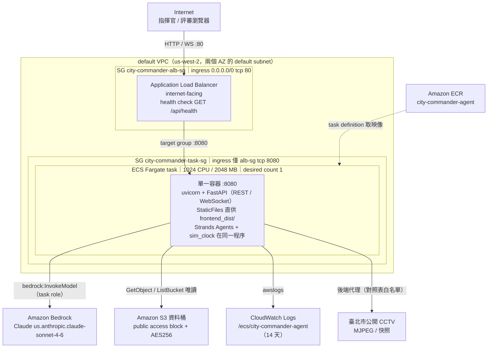
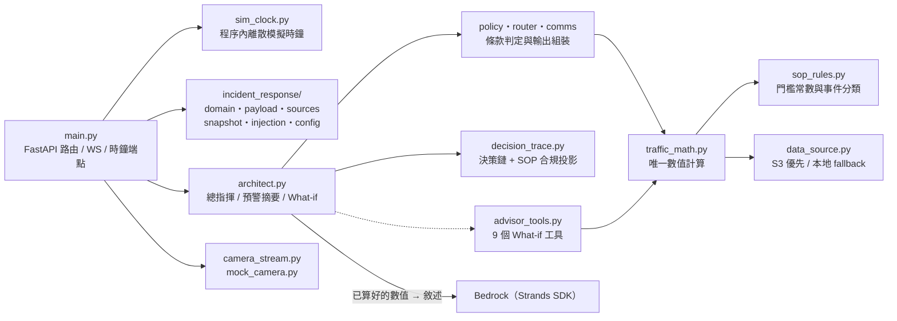
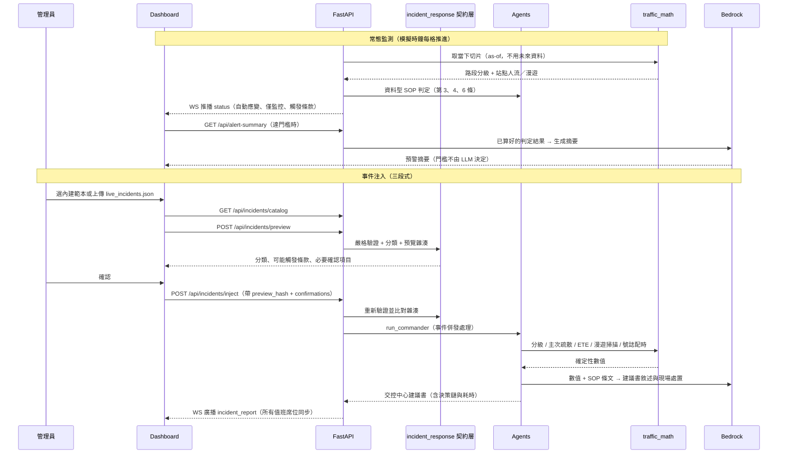

# 系統架構

## 部署總覽

正式環境只有**一個 all-in-one 容器**跑在 ECS Fargate，前面掛 internet-facing ALB。
映像由 `backend/Dockerfile` 多階段建置：先 `npm run build` 產出 React/Vite 前端，
再複製進 Python 3.13 FastAPI 映像的 `frontend_dist/`，由 FastAPI 以 StaticFiles 提供。
因此前端、`/api/*` 與 `/ws/dashboard` 全部**同源**，沒有反向代理、也沒有第二個容器。



`scripts/deploy-ecs-fargate.sh` 是唯一的部署入口，會建立或更新上圖所有資源：
S3 資料桶（`aws s3 sync data/`，排除 `live_incidents.json`）、CloudWatch Logs group、
ECR repo、兩個 IAM role（`CityCommanderEcsTaskExecutionRole` 拉映像寫日誌，
`CityCommanderEcsTaskRole` 只有 Bedrock InvokeModel 與該桶前綴的 S3 唯讀）、
ECS cluster、兩個安全群組、ALB / target group / listener、task definition 與 ECS service。

目前線上環境：region `us-west-2`、帳號 `961701854705`、
入口 `http://city-commander-alb-272857069.us-west-2.elb.amazonaws.com`。

## 容器內部分層



## 黑客松五大模組對照

| 模組 | 後端實作 | API / 傳輸 | 前端 |
|---|---|---|---|
| 動態時序監測儀表板 | `sim_clock.py`、`traffic_math`、`policy`（第 3、4、6 條資料型偵測） | `GET /api/status`、`/api/trend`、`/api/timeline`、`/api/clock`、`/api/stream`、`/api/cameras*`、`WS /ws/dashboard` | `DashboardTab`、`SegmentMonitorTab`、`TrendChart`、`TimelineControl`、`CityMap3D`、`StreetCam` |
| 突發事件注入與 60 秒處置 | `incident_response/`（嚴格契約層）、`architect.run_commander` | `GET /api/incidents/catalog` → `POST /api/incidents/preview`（或 `/preview/upload`）→ `POST /api/incidents/inject`；回應帶 `elapsed_ms` / `elapsed_seconds` / `within_budget`，完成後 WS 廣播 `incident_report` | `InjectionTab`、`IncidentResponsePanel`、`AdvisoryCard` |
| 對話式策略諮詢顧問 | `architect.py` + `advisor_tools.py`（9 個工具、保留對話記憶） | `POST /api/what-if`、`POST /api/what-if/reset` | `AdvisorChat`、`FloatingAdvisor` |
| AI 決策推理與解釋鏈（含 ETE） | `decision_trace.build_decision_trace` / `build_sop_conformance`、`traffic_math.calculate_ete`、`router.py` | 建議書內的 `decision_trace`、`sop_conformance`、路徑候選與 ETE 欄位 | `AiReasoningTrace`、`DecisionTracePanel`、`SopConformancePanel`、`RouteCandidateTable` |
| 多語化全通路通報（漫遊率 ≥ 30%） | `comms.py`（zh-TW / en / ja / ko）、`traffic_math.scan_roaming`、`policy.check_sop6_trigger`、`sop_rules.SOP6_ROAMING_THRESHOLD` | 建議書的 `comms` 區塊、`GET /api/status` 的資料型觸發、`GET /api/alert-summary` | `CMSInline`、`AlertCenter`、`AlertToast`、`AlertHistoryPanel` |

## 職責邊界（抗幻覺設計）

| 層 | 負責 | 明確不負責 |
|---|---|---|
| `sop_rules` | SOP 門檻常數、事件分類、上下游判定 | 讀資料、算數值 |
| `traffic_math` | **所有**數值計算：分級、路徑篩選、ETE、漫遊掃描、號誌配時 | 判斷該不該做、產生文字 |
| `policy` | SOP 1~7 觸發判定、條文原文擷取 | 數值計算 |
| `router` / `comms` | 組裝路徑／ETE／多語通報結構 | 自行推算數字 |
| `architect` | 流程協調、跨單位請求、呼叫 LLM 產生敘述 | 產生任何未經計算的數值 |
| Bedrock LLM | **只**把算好的結果寫成自然語言、產生預警摘要、回答 What-if | 判定門檻、計算 ETE、決定路徑 |

命題要求「門檻判定由程式運算、摘要由 LLM 生成」「ETE 由公式即時計算，LLM 僅負責解釋結果」，
上表就是這條界線的實作對照。

## 資料來源

`data/` 共七份檔案：`city_traffic_flow.csv`、`signaling_crowd_density.csv`、
`road_network_geometry.json`、`emergency_traffic_sop.txt`、`segment_cameras.json`、
`segment_coordinates.json`、`live_incidents.json`。

執行時的資料一律經 `backend/data_source.py` 取用：設定 `S3_DATA_BUCKET` 時優先讀 S3 並
快取到本機，讀取失敗（無桶、無權限、物件不存在）自動退回映像內的 `data/`，服務不中斷。
`live_incidents.json` 是注入用的事件範本，部署腳本刻意不同步到 S3；
`segment_coordinates.json` 只是 `scripts/build_camera_map.py` 的離線輸入，執行時不讀取。

## 資料流



## 為何沒有使用 Bedrock Knowledge Base

`emergency_traffic_sop.txt` 只有 7 條規則、約 1.8k 字，遠小於單次請求的 context 上限，
全文注入不會有 chunk 邊界與檢索遺漏問題。判定本身也不依賴檢索：條件已在 `sop_rules`
與 `traffic_math` 實作為確定性規則，LLM 只需要條文原文來寫說明。
引用可追溯性由 `policy.parse_clauses` 依條號切出原文提供，等同 citation 但沒有向量檢索的不確定性。
導入 Knowledge Base 需要 OpenSearch Serverless，對 7 條規則是過度設計，
還多一個 Demo 當天可能失效的外部依賴。

若 SOP 未來成長到數十份文件，`policy.read_traffic_sop` 是唯一取用入口，
換成檢索呼叫只需改動該函式，其餘模組不受影響。

## Demo 前檢查清單

```bash
BASE=http://city-commander-alb-272857069.us-west-2.elb.amazonaws.com

# 1. Bedrock 實際可用（模型 ID 或 IAM 有誤時，AI 功能會靜默退回確定性 fallback）
curl -fsS "$BASE/api/health?probe=true" | jq .bedrock_probe

# 2. 資料來源（S3 或本地 fallback）
curl -fsS "$BASE/api/health" | jq .data_source

# 3. 路網狀態、自動應變與資料型 SOP 觸發
curl -fsS "$BASE/api/status" | jq '{
  sim_time, data_mode,
  auto: [.auto_advisories[].road_name],
  monitored: [.monitored_alerts[].road_name],
  sop: .data_triggers.triggered_numbers
}'

# 4. SOP 條文可擷取
curl -fsS "$BASE/api/sop" | jq '.clauses | length'

# 5. 端到端 60 秒預算（preview → inject 三段式）
PAYLOAD=$(cat data/live_incidents.json)
PREVIEW=$(curl -fsS -X POST "$BASE/api/incidents/preview" \
  -H 'Content-Type: application/json' -d "{\"payload\": $PAYLOAD}")
curl -fsS -X POST "$BASE/api/incidents/inject" \
  -H 'Content-Type: application/json' \
  -d "$(jq -n --argjson p "$PAYLOAD" --argjson v "$PREVIEW" \
        '{payload: $p, preview_hash: $v.preview.preview_hash,
          confirmations: $v.preview.required_confirmations}')" \
  | jq '.report | {elapsed_seconds, within_budget, processed}'
```

若部署時設了 `INCIDENT_INJECT_TOKEN`，第 5 步的 inject 需加上 `-H "X-Admin-Token: <token>"`。
